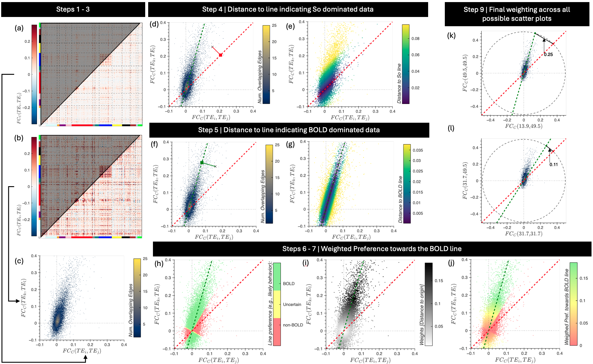

# Description

This repo contains the code accompanying the publication titled **"A new fMRI quality metric using multi-echo information: Theory, validation and implications"**. The work defines and empirically validates a new quality assurance metric for multi-echo fMRI called pBOLD.

Two ways in which this code might be useful:

1) To reproduce results and figures in the manuscript. Please check information in the accompanying [wiki](../../wiki) for details intrustions about how the code is organized and the order in which to run it.

2) To compute pBOLD on your own data. For this, you can use the standalone program [compute_pBOLD.py](./code/python/compute_pBOLD.py) contained in this repo.

